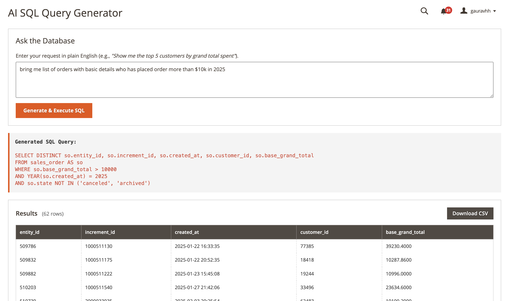
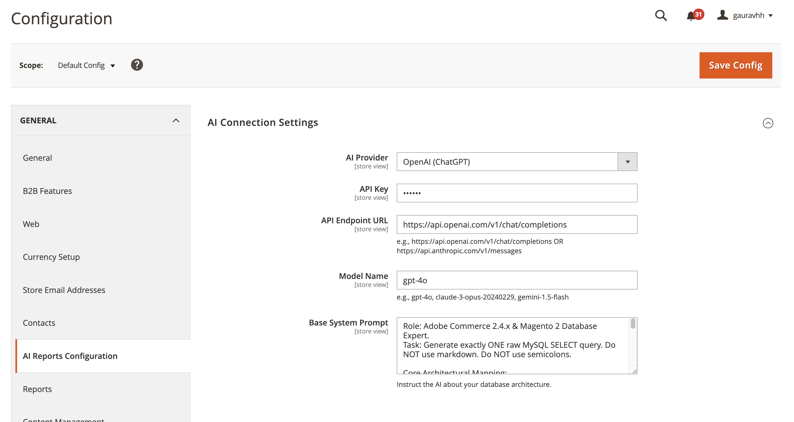

# Gaurav AI Report for Magento 2

An intelligent, automated reporting engine that leverages AI to analyze Magento store data and generate actionable insights without manual data crunching.

## 📖 Why This Module?

Traditional Magento reporting requires store owners and developers to manually export CSVs, sift through complex grid data, or write custom SQL queries to figure out what's going on. 

**Gaurav_AiReport** changes the paradigm by introducing an LLM-powered (Large Language Model) assistant directly into your Adobe Commerce environment. 
* **Automated Insights:** Turns raw data (like [sales trends / system logs / code health]) into easy-to-read human summaries.
* **Proactive Recommendations:** Doesn't just tell you *what* happened, but uses AI to suggest *what to do next*.
* **Time Saving:** Replaces hours of manual monthly auditing with a single scheduled report.

---

## 🖥️ Preview & UI

### 1. The AI Insights Dashboard

*A clean, centralized view where administrators can read AI-generated summaries of the store's performance and health metrics.*

### 2. Module Configuration & API Setup

*Easily connect your preferred AI provider (OpenAI, Gemini, etc.), set up automated reporting schedules, and define which data points the AI is allowed to analyze.*

---

## ⚙️ Configuration & Navigation

After installation, you can configure the AI engine and view your reports via the following paths:

### AI Reports Dashboard
Navigate to: **Reports > Gaurav Extensions > AI Store Reports**
*This is where you view your generated AI summaries, past report history, and actionable recommendations.*

### System Configuration
Navigate to: **Stores > Configuration > Gaurav Extensions > AI Report**
Here you can configure:
* **Enable/Disable:** Master switch for the module.
* **API Credentials:** Enter your [OpenAI / Gemini / Anthropic] Secret Key.
* **Model Selection:** Choose which LLM model to use (e.g., `gpt-4o`, `gemini-1.5-pro`) to balance speed and intelligence.
* **Report Frequency:** Configure the cron schedule (Daily, Weekly, Monthly) for automated report generation.
* **Data Scopes:** Toggle which data the AI has access to (e.g., [Order Data, Error Logs, Catalog Statistics]).

---

## 🏗️ Technical Architecture

This module is built with strict adherence to Magento performance and security standards:
* **Secure Data Handling:** Only aggregated, anonymized data is sent to the LLM API. **No Personally Identifiable Information (PII) like customer names or raw credit card data ever leaves your server.**
* **Asynchronous Processing:** API calls to the LLM are handled via Magento's background Message Queue / Cron system to ensure the Admin UI never freezes while waiting for a response.
* **Cost Control:** Includes built-in token-limiters and caching so you don't accidentally run up a massive API bill.

---

## 🛠️ Installation & Setup

Standard installation via Composer:

```bash
composer require gauravharsh/module-ai-report
bin/magento module:enable Gaurav_AiReport
bin/magento setup:upgrade
bin/magento setup:di:compile
bin/magento cache:flush