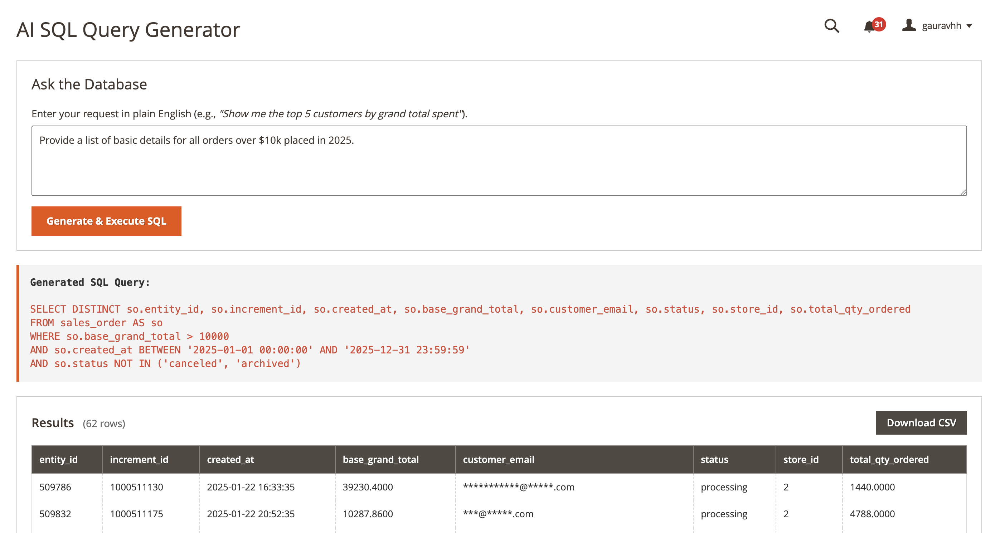
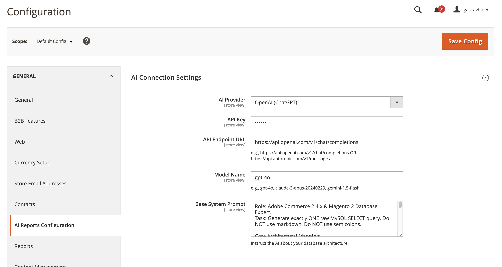

# Gaurav AI Reports for Magento 2

A natural-language-to-SQL reporting tool for Adobe Commerce / Magento 2. Type a question in plain English in the admin, an LLM (OpenAI, Anthropic, Google Gemini, or any OpenAI-compatible endpoint) turns it into a `SELECT` query, and the module runs it against a dedicated **read-only** database connection and shows you the results.

```
"Show me the top 5 customers by grand total spent"
```

## Why this module?

Store owners and support staff often need one-off answers from the database — "how many orders over $10k this year", "which customers haven't ordered in 6 months" — without waiting on a developer to write SQL or build a report. This module lets a trusted admin ask in plain English and get a table of results back in seconds, while enforcing that the tool can never write, alter, or delete anything.

## Preview

### Ask the Database

*Type a request in plain English; the generated SQL and the results table are both shown, with the SQL panel collapsed by default.*

### System Configuration

*Connect an AI provider, choose a model, and instruct the assistant about your database structure via the system prompt.*

---

## How it's secured

This module executes AI-generated SQL against your production database, so read-only access is enforced at multiple independent layers rather than relying on any single check:

1. **A dedicated, read-only MySQL user, configured only in `app/etc/env.php`.** The tool refuses to run at all until this is set. It connects to the same host/schema Magento already uses (from `env.php`) — only the username and password differ. Because the credential lives in `env.php` rather than admin config, it can't be viewed or changed by anyone through the admin UI — not even someone holding the `Gaurav_AiReports::config` permission. Changing it requires server file access, the same bar as Magento's own DB credentials. This connection is never the same one Magento's application code uses for everything else.
2. **A forced read-only session.** On top of the MySQL user's own `GRANT`s, every connection this module opens issues `SET SESSION TRANSACTION READ ONLY`, so even a misconfigured grant can't result in a write.
3. **Query validation before execution.** Only `SELECT` / `SHOW` / `EXPLAIN` / `DESCRIBE` statements are allowed; SQL comments and multiple statements are rejected outright (rather than silently truncated); a keyword blocklist catches destructive/administrative statements and file-system functions (`INTO OUTFILE`, `LOAD_FILE`, etc.).
4. **A non-configurable table denylist.** Credential/token tables (`admin_user`, `oauth_token`, `api_key`, `vault_payment_token`, `core_config_data`, and others) can never be queried, no matter what an admin sets in config. Store-specific sensitive tables (e.g. `customer_entity`) can be added on top of that floor.
5. **Guardrails against abuse.** An automatic row `LIMIT` (default 1000) is appended to any query that doesn't specify one; a best-effort per-query execution timeout is set; prompts are capped at 2000 characters.
6. **Output is escaped, not trusted.** Every value rendered from a query result goes through HTML-escaping before it touches the page (result rows come from the database, not from a fixed template, so this matters). CSV export additionally guards against formula-injection (a cell starting with `=`, `+`, `-`, or `@` is neutralized so it can't execute as a formula when opened in Excel/Sheets).
7. **HTTPS-only, timeout-bound AI calls.** The configured API endpoint must be HTTPS; requests don't follow redirects and have connect/total timeouts, so a slow or hijacked endpoint can't hang the admin or leak the API key to a redirect target.
8. **Two independent ACL permissions.** *Run queries* (`Gaurav_AiReports::query`) and *edit configuration, including credentials* (`Gaurav_AiReports::config`) are separate resources — a role can be granted one without the other. Reviewing the audit trail (`Gaurav_AiReports::log`, see below) is a third, independent permission.
9. **Full audit trail.** Every prompt/query is logged with the admin's username, IP address, the SQL that ran, success/failure, and row count — both to a dedicated log file and to a database table with an admin grid to browse it (see below).
10. **Config that can't drift per scope.** The read-only credentials and all guardrail settings are locked to the global/default scope, so there's no way for a website- or store-view-level override to leave one scope less protected than the others.

Known limitation: every admin with query access queries through the same read-only connection, so all query-tool users currently see the same restricted view of the database (governed by the table denylist). Per-role data restrictions (e.g. a marketing role seeing less than an operations role) aren't implemented.

---

## Navigation

| Location | Purpose |
|---|---|
| **Reports > AI SQL Reports** | The "Ask the Database" tool itself. |
| **Reports > AI Reports Query Log** | Audit grid — every prompt/query run through the tool, by whom, when, and with what result. Requires the `Gaurav_AiReports::log` permission. |
| **Stores > Configuration > AI Reports Configuration** | AI provider connection and security guardrails. Requires the `Gaurav_AiReports::config` permission. |

### System Configuration

- **AI Connection Settings** — provider (OpenAI, Anthropic, Google Gemini, or Custom/OpenAI-compatible for Azure OpenAI, Ollama, Groq, OpenRouter, vLLM, etc.), API key, API endpoint URL (must be HTTPS), exact model ID (e.g. `gpt-4o`, `claude-sonnet-5`, `gemini-1.5-flash` — not a marketing name), and a system prompt describing your database schema to the AI.
- **Read-Only Database Connection** — informational only; shows the exact `env.php` snippet and `GRANT` SQL needed. There's nothing to fill in here on purpose (see above).
- **Security Guardrails** — the master enable switch (off by default), max rows per query, query timeout, and any additional blocked tables.

---

## Installation

```bash
composer require gauravharsh/module-ai-reports
bin/magento module:enable Gaurav_AiReports
bin/magento setup:upgrade
bin/magento setup:db-declaration:generate-whitelist --module-name=Gaurav_AiReports
bin/magento setup:di:compile
bin/magento cache:flush
```

The `generate-whitelist` step is required because this module ships a database table for the audit log (`gaurav_aireports_query_log`) via declarative schema.

## Setup after installing

1. **Create the read-only MySQL user** (adjust the database name to match your `env.php`):
   ```sql
   CREATE USER 'aireports_ro'@'%' IDENTIFIED BY 'a-strong-random-password';
   GRANT SELECT ON your_database_name.* TO 'aireports_ro'@'%';
   FLUSH PRIVILEGES;
   ```
   Restrict the host part (`'%'`) to your application server where possible, and consider revoking `SELECT` on individual sensitive tables for extra defense in depth on top of the module's own denylist.
2. **Add the credentials to `app/etc/env.php`** (never to admin config, and never commit this file):
   ```php
   'aireports' => [
       'readonly_connection' => [
           'username' => 'aireports_ro',
           'password' => 'a-strong-random-password',
       ],
   ],
   ```
   Deploy/restart so the new `env.php` is picked up.
3. Go to **Stores > Configuration > AI Reports Configuration** and fill in your AI provider details, then review the guardrails.
4. Flip **Enable Query Tool** to Yes.
5. Assign `Gaurav_AiReports::query`, `Gaurav_AiReports::log`, and `Gaurav_AiReports::config` to admin roles individually, based on who should be able to run queries, review the audit trail, and manage AI provider settings, respectively. `env.php` access (and therefore the DB credential) is controlled entirely outside Magento's ACL, at the server/deploy level.

## License

OSL-3.0 / AFL-3.0
